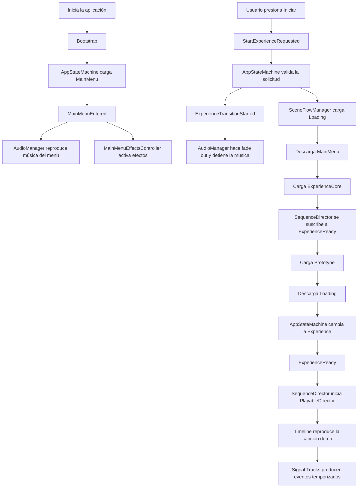

# README — Flujo de audio y secuenciador de la experiencia VR

## 1. Objetivo de esta etapa

En esta etapa se amplió el flujo inicial del proyecto para integrar:

- Música del menú principal.
- Transición de audio al comenzar la experiencia.
- Una escena persistente para el secuenciador.
- Reproducción de la canción demo mediante Timeline.
- Comunicación entre sistemas mediante `ScriptableObject Event Channels`.
- Preparación para eventos sincronizados con la canción.

El flujo objetivo actual es:

```text
Bootstrap
   ↓
MainMenu
   ↓
Loading
   ↓
ExperienceCore + Prototype
   ↓
Timeline reproduce la canción demo
```

> Estado actual: la configuración visual del Timeline y del `AudioSource` está realizada. Se identificaron correcciones necesarias en el código y en la carga de `ExperienceCore`; estas deben validarse ejecutando siempre desde `Bootstrap`.

---

## 2. Arquitectura general

La música del menú y la canción principal tienen responsabilidades diferentes.

### `AudioManager`

Permanece en `Bootstrap` durante toda la aplicación.

Se encarga de:

- Reproducir la música del menú.
- Hacer fade in y fade out.
- Reproducir SFX generales.
- Reproducir ambientes.
- Reproducir loops de SFX.
- Enviar cada categoría al grupo correspondiente del `AudioMixer`.

### `SequenceDirector`

Permanece en la escena `ExperienceCore` durante toda la canción.

Se encarga de:

- Escuchar el evento `ExperienceReady`.
- Iniciar el `PlayableDirector`.
- Reproducir el Timeline desde el segundo cero.
- Mantener sincronizada la canción con eventos temporizados.
- Posteriormente producir cambios de escena, VFX, iluminación e interacciones.

### `AppStateMachine`

Permanece en `Bootstrap`.

Se encarga de:

- Validar solicitudes de transición.
- Publicar eventos de estado.
- Solicitar a `SceneFlowManager` la carga de las escenas.
- Cambiar el estado general de la aplicación.

### `SceneFlowManager`

Es el único responsable de:

- Cargar escenas aditivamente.
- Descargar escenas.
- Establecer la escena activa.
- Cargar `ExperienceCore` antes de publicar `ExperienceReady`.

---

## 3. Diagrama del flujo



Versión resumida:

```text
MainMenuEntered
    ├── AudioManager → música del menú
    └── MainMenuEffectsController → VFX del menú

StartExperienceRequested
    ↓
AppStateMachine valida
    ↓
ExperienceTransitionStarted
    ├── AudioManager → fade out y Stop
    └── SceneFlowManager → Loading + ExperienceCore + Prototype
                                  ↓
                           ExperienceReady
                                  ↓
                         SequenceDirector
                                  ↓
                        PlayableDirector.Play()
                                  ↓
                      Timeline + canción demo
```

---

## 4. Escenas actuales

```text
Bootstrap
├── AppStateMachine
├── SceneFlowManager
├── AudioManager
├── XRSystems
└── otros managers globales

MainMenu
├── UI
├── MainMenuController
├── MainMenuEffectsController
└── contenido visual del menú

Loading
└── pantalla o spinner de carga

ExperienceCore
├── SequenceDirector
├── PlayableDirector
├── SignalReceiver
└── ExperienceMusicSource

Prototype
└── contenido visual temporal de la experiencia
```

### Regla importante

`ExperienceCore` debe cargarse antes de publicar `ExperienceReady`.

Si `ExperienceReady` se publica cuando `ExperienceCore` todavía no existe, `SequenceDirector` no estará suscrito y el Timeline no comenzará.

---

## 5. Event Channels creados

Los canales actuales son assets de tipo `VoidEventChannelSO`.

```text
EventChannels/
└── Application/
    ├── MainMenuEntered.asset
    ├── StartExperienceRequested.asset
    ├── ExperienceTransitionStarted.asset
    └── ExperienceReady.asset
```

### Productores y consumidores

| Evento | Productor | Consumidores |
|---|---|---|
| `MainMenuEntered` | `AppStateMachine` | `AudioManager`, `MainMenuEffectsController` |
| `StartExperienceRequested` | `MainMenuController` | `AppStateMachine` |
| `ExperienceTransitionStarted` | `AppStateMachine` | `AudioManager` |
| `ExperienceReady` | `AppStateMachine` | `SequenceDirector` |

Todos los productores y consumidores deben tener asignado exactamente el mismo asset correspondiente.

Por ejemplo:

```text
AppStateMachine
        │
        ▼
ExperienceReady.asset
        │
        ▼
SequenceDirector
```

`ExperienceReady.asset` y `ExperienceReady 1.asset` serían canales diferentes aunque tengan el mismo tipo.

---

## 6. Configuración del AudioMixer

Se utiliza un `AudioMixer` llamado actualmente `VolOptions`.

Estructura recomendada:

```text
Master
├── Music
├── Ambience
└── SFX
```

Asignaciones:

```text
MusicSource              → Music
ExperienceMusicSource    → Music
AmbienceSource           → Ambience
SFXSource                → SFX
LoopSFXSource            → SFX
```

---

## 7. AudioManager

### Ubicación

```text
Bootstrap
└── AudioManager
    ├── MusicSource
    ├── AmbienceSource
    ├── SFXSource
    └── LoopSFXSource
```

### Música del menú

`MusicSource` reproduce la canción del menú cuando recibe:

```text
MainMenuEntered
```

Configuración recomendada del `AudioSource`:

```text
Output: Music
Play On Awake: Off
Loop: administrado por código
Spatial Blend: 0
Volume: 1
```

### Corrección identificada: suscripción faltante

`AudioManager` debe suscribirse tanto a `MainMenuEntered` como a `ExperienceTransitionStarted`.

```csharp
private void OnEnable()
{
    if (mainMenuEntered != null)
    {
        mainMenuEntered.Raised += HandleMainMenuEntered;
    }

    if (experienceTransitionStarted != null)
    {
        experienceTransitionStarted.Raised +=
            HandleExperienceTransitionStarted;
    }
}

private void OnDisable()
{
    if (mainMenuEntered != null)
    {
        mainMenuEntered.Raised -= HandleMainMenuEntered;
    }

    if (experienceTransitionStarted != null)
    {
        experienceTransitionStarted.Raised -=
            HandleExperienceTransitionStarted;
    }
}
```

Sin esta suscripción, `AppStateMachine` publica el evento, pero `AudioManager` nunca ejecuta el fade.

### Corrección identificada: detener después del fade

La llamada correcta debe usar `true` en `stopAfterFade`:

```csharp
private void FadeOutMenuMusic()
{
    if (!musicSource.isPlaying)
    {
        return;
    }

    StopCurrentFade();

    musicFadeCoroutine = StartCoroutine(
        FadeMusicRoutine(
            0f,
            musicFadeDuration,
            true));
}
```

Al finalizar:

```csharp
if (stopAfterFade)
{
    musicSource.Stop();
    musicSource.clip = null;
    musicSource.volume = defaultMusicVolume;
}
```

---

## 8. ExperienceCore y Timeline

### Jerarquía

```text
ExperienceCore
└── SequenceDirector
    ├── PlayableDirector
    ├── SignalReceiver
    └── ExperienceMusicSource
```

La jerarquía exacta puede variar; lo importante es que los componentes estén dentro de `ExperienceCore`.

### `PlayableDirector`

Configuración:

```text
Playable: PlayableDirectorTimeline
Update Method: Game Time
Play On Awake: Off
Wrap Mode: None
Initial Time: 0
```

`Play On Awake` permanece desactivado porque el Timeline se inicia mediante el evento `ExperienceReady`.

### `ExperienceMusicSource`

Configuración:

```text
Audio Generator / Audio Clip: None
Output: Music
Play On Awake: Off
Loop: Off
Volume: 1
Pitch: 1
Spatial Blend: 0
Doppler Level: 0
```

El clip permanece vacío porque la canción se encuentra dentro del `Audio Track` del Timeline.

### Binding del Audio Track

El `Audio Track` debe estar vinculado a:

```text
ExperienceMusicSource (AudioSource)
```

Flujo del audio:

```text
AudioClip dentro del Timeline
        ↓
Audio Track
        ↓
ExperienceMusicSource
        ↓
AudioMixerGroup Music
        ↓
Master
        ↓
AudioListener de la cámara XR
```

---

## 9. SequenceDirector

`SequenceDirector` escucha `ExperienceReady` y luego inicia el Timeline.

```csharp
using UnityEngine;
using UnityEngine.Playables;

public sealed class SequenceDirector : MonoBehaviour
{
    [Header("Timeline")]
    [SerializeField]
    private PlayableDirector playableDirector;

    [Header("Event Channel")]
    [SerializeField]
    private VoidEventChannelSO experienceReady;

    private bool sequenceStarted;

    private void OnEnable()
    {
        Debug.Log(
            $"SequenceDirector habilitado en '{gameObject.scene.name}'.",
            this);

        if (experienceReady == null)
        {
            Debug.LogError(
                "ExperienceReady no está asignado.",
                this);

            return;
        }

        experienceReady.Raised += HandleExperienceReady;
    }

    private void OnDisable()
    {
        if (experienceReady != null)
        {
            experienceReady.Raised -= HandleExperienceReady;
        }
    }

    private void HandleExperienceReady()
    {
        Debug.Log(
            "SequenceDirector recibió ExperienceReady.",
            this);

        if (sequenceStarted)
        {
            return;
        }

        if (playableDirector == null)
        {
            Debug.LogError(
                "PlayableDirector no está asignado.",
                this);

            return;
        }

        if (playableDirector.playableAsset == null)
        {
            Debug.LogError(
                "No hay Timeline asignado al PlayableDirector.",
                this);

            return;
        }

        sequenceStarted = true;

        playableDirector.time = 0d;
        playableDirector.Evaluate();
        playableDirector.Play();

        Debug.Log(
            $"Timeline iniciado. Estado: {playableDirector.state}.",
            this);
    }
}
```

---

## 10. SceneFlowManager

La transición ya no debe cargar únicamente `Prototype`.

Debe cargar:

```text
Loading
ExperienceCore
Prototype
```

Orden recomendado:

```csharp
public IEnumerator TransitionToPrototype()
{
    yield return LoadAdditive(loadingScene);
    SetActiveScene(loadingScene);

    yield return null;

    yield return UnloadIfLoaded(mainMenuScene);

    yield return LoadAdditive(experienceCoreScene);

    yield return LoadAdditive(prototypeScene);
    SetActiveScene(prototypeScene);

    // Permite que ExperienceCore complete Awake y OnEnable.
    yield return null;

    yield return UnloadIfLoaded(loadingScene);
}
```

Campo necesario:

```csharp
[SerializeField]
private string experienceCoreScene = "ExperienceCore";
```

Las escenas también deben estar agregadas al perfil de compilación.

---

## 11. AppStateMachine

Flujo relevante:

```csharp
private IEnumerator StartExperienceRoutine()
{
    isTransitioning = true;
    CurrentState = AppState.Loading;

    if (experienceTransitionStarted != null)
    {
        Debug.Log(
            "AppStateMachine publica ExperienceTransitionStarted.",
            this);

        experienceTransitionStarted.RaiseEvent();
    }

    yield return sceneFlowManager.TransitionToPrototype();

    // ExperienceCore ya está cargada y suscrita.
    yield return null;

    CurrentState = AppState.Experience;

    if (experienceReady != null)
    {
        Debug.Log(
            "AppStateMachine publica ExperienceReady.",
            this);

        experienceReady.RaiseEvent();
    }
    else
    {
        Debug.LogError(
            "ExperienceReady no está asignado.",
            this);
    }

    isTransitioning = false;
}
```

---

## 12. Orden esperado en la consola

Al ejecutar desde `Bootstrap`:

```text
AppStateMachine publica MainMenuEntered.
AudioManager recibió MainMenuEntered.

Usuario presiona Iniciar.

AppStateMachine publica ExperienceTransitionStarted.
AudioManager recibió ExperienceTransitionStarted.

SequenceDirector habilitado en 'ExperienceCore'.
SequenceDirector suscrito a ExperienceReady.

AppStateMachine publica ExperienceReady.
SequenceDirector recibió ExperienceReady.
Timeline iniciado. Estado: Playing.
```

Diagnóstico:

- No aparece `AudioManager recibió ExperienceTransitionStarted`: falta la suscripción o el asset no coincide.
- No aparece `SequenceDirector habilitado`: `ExperienceCore` no se cargó.
- Aparece habilitado, pero no recibe `ExperienceReady`: los assets no coinciden o el evento se publicó demasiado pronto.
- Aparece `Timeline iniciado`, pero no hay audio: revisar binding, `AudioMixer`, volumen y `AudioListener`.

---

## 13. Cómo probar correctamente

Siempre iniciar desde:

```text
Bootstrap
```

No iniciar directamente desde `ExperienceCore`, porque esa escena no contiene:

- Cámara XR.
- `AudioListener`.
- `AppStateMachine`.
- `SceneFlowManager`.
- Publicación de `ExperienceReady`.

Que `ExperienceCore` muestre `No cameras rendering` al abrirla sola es normal.

### Checklist de prueba

- [ ] `AudioManager` escucha ambos eventos.
- [ ] `FadeOutMenuMusic()` usa `stopAfterFade = true`.
- [ ] `ExperienceCore` está en el perfil de compilación.
- [ ] `SceneFlowManager` carga `ExperienceCore`.
- [ ] `ExperienceCore` se carga antes de `ExperienceReady`.
- [ ] `AppStateMachine` y `SequenceDirector` usan el mismo asset.
- [ ] `Audio Track` está vinculado con `ExperienceMusicSource`.
- [ ] `ExperienceMusicSource.Output` apunta a `Music`.
- [ ] Existe un único `AudioListener` en la cámara XR.
- [ ] El cabezal del Timeline avanza durante Play Mode.
- [ ] El medidor del grupo `Music` se mueve.

---

## 14. Próximo paso recomendado

Después de validar que la canción demo comienza correctamente:

1. Crear un evento de prueba, por ejemplo `SequenceTestCue`.
2. Crear una señal en el segundo 5 del Timeline.
3. Hacer que el `SignalReceiver` publique `SequenceTestCue`.
4. Crear un consumidor en `Prototype`.
5. Activar, desactivar o cambiar un objeto al recibir la señal.
6. Confirmar que el evento ocurre exactamente en el momento esperado.

Flujo de prueba:

```text
Timeline llega al segundo 5
        ↓
SignalEmitter
        ↓
SignalReceiver
        ↓
SequenceTestCue.RaiseEvent()
        ↓
SequenceTestReceiver
        ↓
Cambia un objeto de Prototype
```

Luego se podrá avanzar hacia:

```text
Scene01
→ Scene02
→ Scene03
→ Scene04
→ Scene05
→ Scene06
→ SongFinished
```

La canción y el Timeline permanecerán en `ExperienceCore`; las escenas contendrán únicamente el contenido visual e interactivo de cada sección.